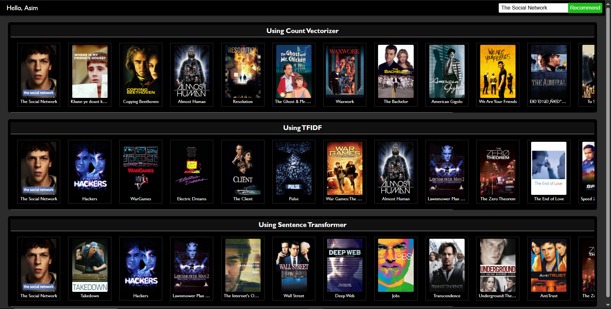

# Content-Based Movie Recommender System

This project uses a content-based recommendation system built from TMDB datasets. It recommends similar movies based on Cast, Directors, Keywords, Genres, Release Decade and Overview, they are vectorized using 3 methods:
1- Count Vectorizer
2- TF-IDF
3- Sentence Transformer



---

## Getting Started

1. **Clone the repository**
   ```bash
   git clonehttps://github.com/asim-baral/content-based-movie-rs.git
   cd content-based-movie-rs
   ```

2. **Install dependencies**
   Make sure you have Python 3.8+ installed. Then run:
   ```bash
   pip install -r requirements.txt
   ```

3. **Generate model files**
   - Open `Content_Based_Movie_Recommender.ipynb` in Jupyter Notebook or VS Code.
   - Run all cells to process the data and generate the following files (Comment and Uncomment accordingly to generate different files):
     - `movies.pkl`
     - `similarityVector.pkl`
     - `similarityVectorTFIDF.pkl`
     - `similarityVectorTransformer.pkl`

4. **Set up your TMDB API key**
   - Sign up at [TMDB](https://www.themoviedb.org/) and generate an API key.
   - Create a file named `.env` in your project root (if it doesn't exist).
   - Add your API key to the `.env` file like this:
     ```
     TMDB_API_KEY=your_tmdb_api_key_here
     ```

5. **Start the FastAPI server**
   ```bash
   uvicorn main:app --reload
   ```
